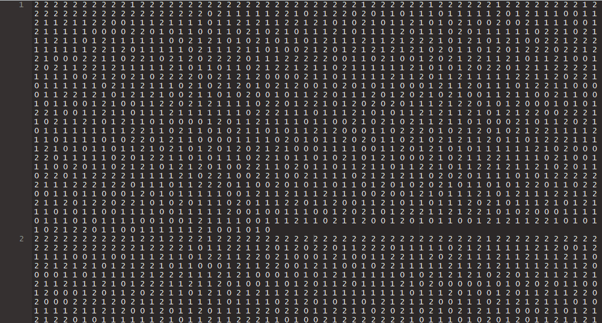

[](https://travis-ci.org/privefl/mmapcharr)
[](https://ci.appveyor.com/project/privefl/mmapcharr)
[](https://codecov.io/github/privefl/mmapcharr?branch=master)
[](https://cran.r-project.org/package=mmapcharr)


# mmapcharr

Memory-map text files of characters. 

## Installation

```r
# For the CRAN version
## Coming soon!

# For the current development version
devtools::install_github("privefl/mmapcharr")
```

## Input format

As inputs, package **mmapcharr** uses text files of characters separated by another character.
Lines should be the same so that the file can be viewed as a matrix.
Files should end up with an empty line. 

For now, only digits characters are supported. If you want to access matrices of letters, feel free to ask for this feature. Note that you can already access letters as integers by playing with the `code` parameter.



You can access files in such shape the same way as for R(cpp) matrices.

## Example code

```r
test_file <- system.file("testdata/test-windows.txt", package = "mmapcharr")
readLines(test_file)

# Create the memory-mapping object based on the text file
test <- digimat(test_file, code = mmapcharr:::CODE_012)
test[]
test[, 1:3]

# Change the code of the accessed integers
test$code <- rep(5L, 256)
test[, 1:3]

# Underlying characters
rawToChar(as.raw(0:255), multiple = TRUE)
```


## Bug report / Help

Please open an issue if you find a bug.


## Code of conduct

Please note that this project is released with a [Contributor Code of Conduct](https://github.com/privefl/mmapcharr/blob/master/code_of_conduct.md). 
By participating in this project you agree to abide by its terms.
